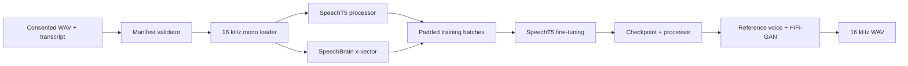

# Reproducible SpeechT5 Fine-tuning Pipeline

A complete, Dockerized reference project for adapting
[`microsoft/speecht5_tts`](https://huggingface.co/microsoft/speecht5_tts) to a clean,
consented speech dataset. It covers manifest validation, audio preprocessing, SpeechBrain
x-vector extraction, training, checkpointing, and WAV inference.

> **Consent is required.** Only train on voices and recordings you own or are explicitly
> licensed to use. Do not impersonate people, conceal synthetic audio, or deploy a voice model
> without the speaker's informed permission.

## What is included

- Reproducible pinned Python environment (Python 3.10–3.12).
- CPU Docker image for validation/tests and CUDA image for training.
- Docker Compose services for validation, one-step smoke training, and GPU training.
- Strict manifest and audio validation before any expensive model download.
- 16 kHz preprocessing and normalized 512-dimensional speaker x-vectors.
- Hugging Face `Seq2SeqTrainer` with evaluation, checkpoints, resume support, and run metadata.
- Reference-audio-conditioned inference with the SpeechT5 HiFi-GAN vocoder.
- Tiny generated audio fixtures, unit tests, CI, LJSpeech importer, and detailed operating notes.

The three files in `data/demo` are tonal fixtures. They verify file and tensor plumbing only;
they are deliberately **not** presented as a usable training dataset.

## Pipeline



## Fastest start: Docker

Prerequisites: Docker Engine/Desktop. GPU training additionally requires an NVIDIA GPU, current
drivers, and the NVIDIA Container Toolkit.

```bash
# Validates the included fixture data; no model is downloaded.
docker compose run --rm validate

# Full integration smoke test: downloads the pretrained models and runs one CPU step.
# It can take several minutes and does not produce a useful voice.
docker compose run --rm smoke
```

Production training on one NVIDIA GPU:

```bash
cp data/manifest.example.csv data/manifest.csv
# Edit data/manifest.csv to point at your own recordings, then:
docker compose run --rm validate
docker compose --profile gpu run --rm train-gpu
```

Artifacts are written under `artifacts/`; Hugging Face downloads live in a named Docker volume.
Compose GPU reservations follow the
[official Docker Compose GPU format](https://docs.docker.com/compose/how-tos/gpu-support/).

## Local installation

Use Python 3.10, 3.11, or 3.12. Training on Apple Silicon/CPU is technically possible but much too
slow for a real run.

```bash
python3.11 -m venv .venv
source .venv/bin/activate
make install-dev
make validate
make test
```

For a CUDA workstation, install the PyTorch wheel matching the system CUDA setup, then install the
remaining requirements and this package:

```bash
python -m pip install -r requirements.txt
python -m pip install -e . --no-deps
```

## Prepare a real dataset

Use PCM WAV, one utterance per file, mono, 16 kHz, typically 2–12 seconds. The validator rejects
stereo, wrong rates, duplicates, out-of-range durations, digits, blank values, and missing files.
The manifest is UTF-8 CSV:

```csv
audio_path,text,speaker_id,split
wavs/clip_0001.wav,The quick brown fox jumps over the lazy dog.,speaker_a,train
wavs/clip_0002.wav,This sentence is held out for evaluation.,speaker_a,validation
```

Relative audio paths are resolved against the manifest directory. Put the speaker's recordings in
the same split by utterance, not by chopped fragments from a shared source recording. Normalize
digits to words because the SpeechT5 tokenizer does not represent numbers directly.

For a public-data rehearsal, the LJSpeech helper downloads LJSpeech 1.1 and writes this manifest:

```bash
python scripts/download_ljspeech.py
python -m tts_finetune.validate --config configs/base.yaml
```

The importer requires FFmpeg and converts the original 22.05 kHz files to the pipeline's 16 kHz
format. Use `--limit 100` for a quick data-preparation rehearsal.

Review the dataset's license yourself before any redistribution. More guidance is in
[`docs/DATA.md`](docs/DATA.md).

## Train

Tune `configs/base.yaml` for the GPU and dataset, then run:

```bash
python -m tts_finetune.train --config configs/base.yaml
```

Default effective batch size is `4 × 8 = 32`; 4,000 update steps are a reasonable starting
experiment, not a universal optimum. If VRAM is limited, halve the per-device batch size and double
gradient accumulation. Preprocessing is cached under a versioned directory in
`artifacts/preprocessed`; changes to the manifest, file size/mtime, sample rate, tokenizer checkpoint,
or speaker encoder select a new cache.

Resume from a checkpoint by setting, for example:

```yaml
training:
  resume_from_checkpoint: artifacts/speecht5-checkpoints/checkpoint-2000
```

See [`docs/TRAINING.md`](docs/TRAINING.md) for sizing, quality gates, and experiment notes. The
implementation follows the official
[Hugging Face SpeechT5 fine-tuning recipe](https://huggingface.co/docs/transformers/tasks/text-to-speech).

## Infer

The reference clip supplies the x-vector voice condition. Use clean speech from the consented target
speaker:

```bash
python -m tts_finetune.infer \
  --model artifacts/speecht5-final \
  --reference-audio /path/to/reference.wav \
  --text "This is generated by the fine tuned model." \
  --output outputs/generated.wav
```

SpeechT5 outputs 16 kHz audio. Keep the exact processor saved with the checkpoint. A model trained on
very little data may be unintelligible even when the pipeline succeeds.

## Commands

| Command | Purpose |
|---|---|
| `make demo` | Regenerate the tiny tonal fixtures |
| `make validate` | Validate manifest, audio, splits, and text |
| `make smoke` | Download weights and run one training step |
| `make train` | Run the base production config |
| `make infer` | Generate a WAV from the trained checkpoint |
| `make test` | Run unit tests |
| `make lint` | Run Ruff |

## Expected hardware and time

Validation runs on any laptop. Real fine-tuning needs a CUDA GPU; 16 GB VRAM is a useful minimum
with batch-size adjustment, while 24 GB or more is more comfortable. Preprocessing speed depends on
audio duration and x-vector extraction. Training can take hours. Exact runtime depends heavily on GPU,
dataset, batch size, and storage.

## Important limitations

- SpeechT5 was pretrained in English; other languages may need text normalization and can perform
  worse. Inspect tokenizer unknown characters before training.
- X-vector quality strongly affects the synthesized voice.
- This is full fine-tuning, not LoRA; checkpoints and optimizer state are large.
- The demo is a plumbing fixture, not proof of model quality.
- Always evaluate intelligibility, speaker similarity, artifacts, memorization, privacy, and abuse risk
  before release.

Troubleshooting is in [`docs/TROUBLESHOOTING.md`](docs/TROUBLESHOOTING.md), and a release checklist is
in [`docs/MODEL_CARD_TEMPLATE.md`](docs/MODEL_CARD_TEMPLATE.md).

## License

Project code is Apache-2.0. Model weights, datasets, and generated artifacts retain their own terms.
Downloading them does not transfer rights to you.
